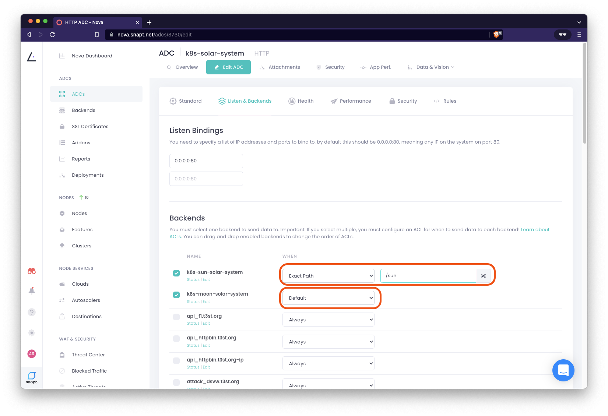

# Configure simple HTTP load Balancing in Nova

In the [last excerise](service-discovery-normal-vs-headless-services.md) we
discovered the importance of using "headless" services in order for Nova to
directly load balance pods. In this lab we can configure the backends using two
important pieces of information: 

 * The Service Discovery Address for **sun**
   (`_http._tcp.sun-svc.solar-system.svc.cluster.local`) and **moon**
   (`_http._tcp.moon-svc.solar-system.svc.cluster.local`)
 * The `clusterIP` of the `kube-dns` service, our DNS Server we make our DNS
   service discovery queries to

### Configure our first backend group

First create a backend for our **moon** application

1. Log into your [Nova Dashboard](https://nova.snapt.net/)
1. Create a new backend: **ADCs > Backends** > [New Backend]

  

1. Create a new Backend for our **sun** application with the following details:
  * **Backend Display Name:**  `k8s-sun-solar-system`
  * **Choose Backend Type:** `DNS Service Discovery`

  

  Hit the **Create Backend** button to continue to the next screen

1. Complete the configurations of the a new Backend for our **sun** application with the following details:
  * **DNS Servers**:  `[DNS Server]` (e.g. `10.100.0.10:53`)
  * **Service Discovery Address**: `[A record or SRV record]` (e.g. `_http._tcp.sun-svc.solar-system.svc.cluster.local`)

  

  Save changes with the **Save & Deploy** button

  We need one more backend for our **moon** application. Continue to next step

1. Follow the same steps as we did to create a new Backend for our **moon** application with the following details:
  * **Backend Display Name:**  `k8s-moon-solar-system`
  * **Choose Backend Type:** `DNS Service Discovery`

  

1. Complete the configurations of the a new Backend for our **sun** application with the following details:
  * **DNS Servers**:  `[DNS Server]` (e.g. `10.100.0.10:53`)
  * **Service Discovery Address**: `[A record or SRV record]` (e.g. `_http._tcp.moon-svc.solar-system.svc.cluster.local`)

  

  Save changes with the **Save & Deploy** button

We now have our two backends for our **sun** and **moon** applications
configured. Continue to next step to create a new ADC policy and complete our
Load balancing configuration

### Setup ADC Policy

Here we create an ADC, this is policy for out ADC service to expose our two
backends, our **sun** and **moon** applications, to the internet

1. Log into your [Nova Dashboard](https://nova.snapt.net/)
1. Create a new ADC: **ADCs > ADCs** > [New ADC]
1. Create a new ADC with the following details:
  * **ADC Name:**  `k8s-solar-system`
  * **Choose Backend Type:** `HTTP`

  

  Hit the **Create ADC** button to continue to the next screen

1. Complete the **Standard** configurations of the a new ADC with the following details:
  * **Balancing Method**:  `Roundrobin`
  * **Session Persistence**: `None`
  * **Nova Vision**: Check (default) - `Enable Nova Vision`

  

  Hit the **Listen & Backends** tab to continue our configuration

1. Complete the **Listen & Backends** configurations of the a new ADC with the following details:
  * **Listen Bindings**:  `0.0.0.0:80` (default)
  * **Backends** (order is important, drag backend to re-order if nessacary): 
    * Checked - **NAME:** `k8s-sun-solar-system`, **WHEN:** `Exact Path`: `sun` 
    * Checked - **NAME:** `k8s-moon-solar-system`, **WHEN:** `Default` 

  This configuration will route all requests to the **moon** application unless
  a request with the exact path `/sun` is made, in which traffic to this url
  path will get routed to the **sun** application 

  

  Hit the **Health** tab to continue our configuration

1. Complete the **Listen & Backends** configurations of the a new ADC with the following details:
  * **Check Type**: **Type:** `Layer 7 -HTTP`, **Path:** `/`, **Down HTTP Codes:** `500-599`
  * Leave others as default: 
    * Rise and Fall - `3` 'failed checks to mark as DOWN' and `5` 'passed checks to mark as ONLINE'
    * Interval - `2000` 'milliseconds between checks'
    * Access Logging - Leave Syslog Host - blank, Log Format - blank (default), sample rate - `100`

  

  For this excerise we can leave the configurations in the **Performance**, **Security** and **Rules** tab as defaults,
  (feel free to inspect those settings)

  Hit the **Update ADC** button to save changes and then got to the
  **Attachments** tab to complete our configuration

1. Complete the **Attachments** configurations of the a new ADC with the following details:
  * **Nodes**: "`k8s-nova`" 

  

  For this excerise we can leave all other configurations as defaults (feel free to inspect those settings)

  Hit the **Update Attachments** button to complete our configuration

1. After a few seconds the New ADC should successfully get deployed to our Nova node in Kubernetes

  

  

Great, we have completed a simple HTTP Load Balancing configuration and should
be able to access our applications from inside the kubernetes cluster and from
the internet!

---

Go back to [Table of Contents](../../README.md)