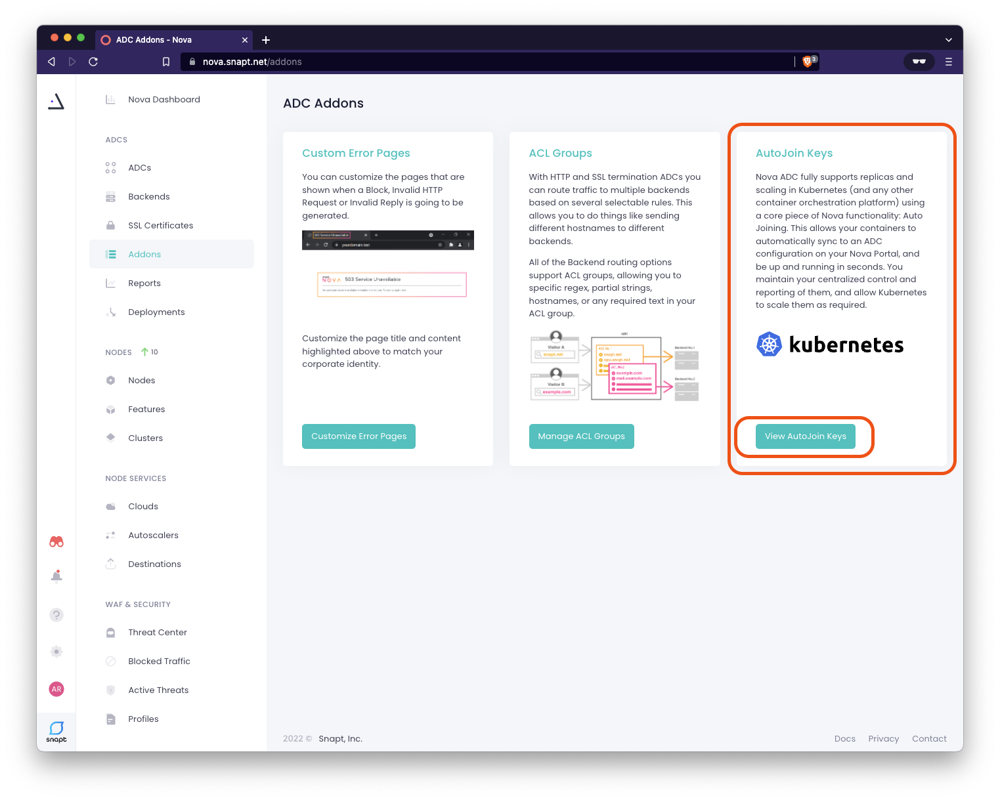
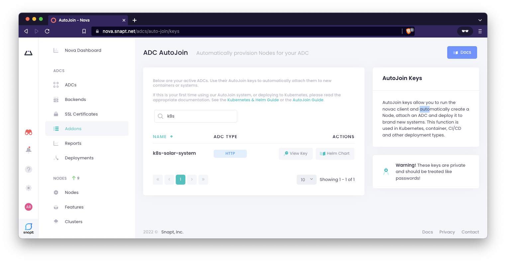
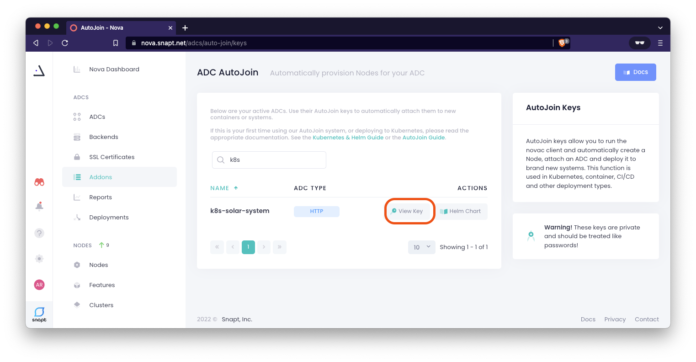
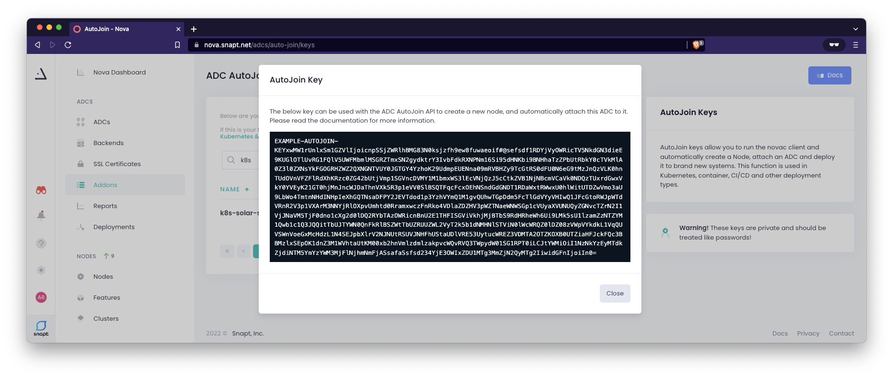
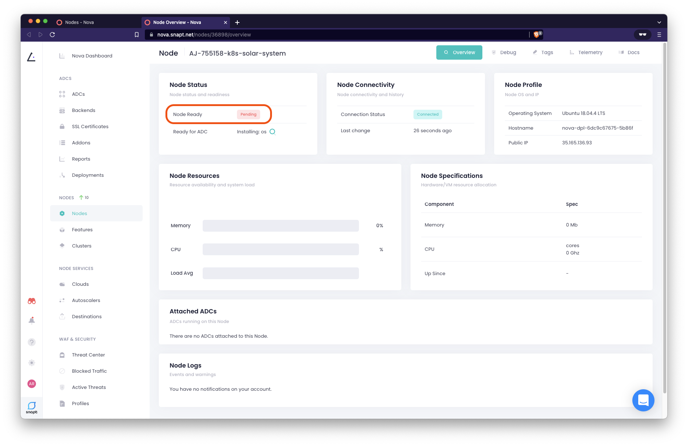
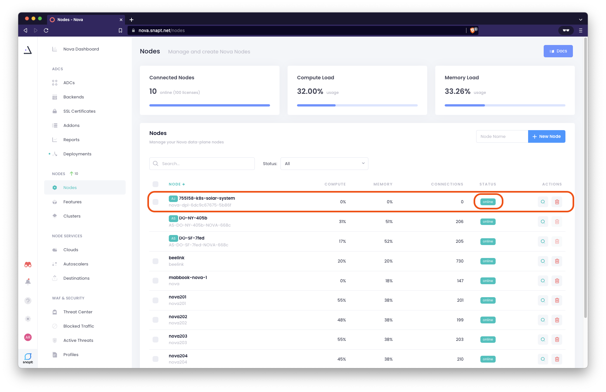

# Deploy Nova for Kubernetes using Helm

## Introduction

Nova for Kubernetes can be easily installed using a [Helm](https://helm.sh/)
chart.

Nova supports replicas and scaling in Kubernetes (and any other container
orchestration platform) using a core component of Nova functionality: [Auto
Joining](https://nova-docs.snapt.net/adcs_autojoin.html). This allows your
containers to automatically sync to an ADC setting on your Nova Portal, and be
up and running in seconds. You retain your centralized control and reporting
over them, and allow Kubernetes to scale them as required.

Upon install, three Kubernetes components are created. This is the *default* state:

 * A namespace following the following convention: `$release_name-nova-ns`
 * A `deployment` with a single replica using the `novaadc` client container
    * `resources` `requests` and `limits` are set (`cpu: 200m` and `memory: 1Gi`)
 * A `service` with type `LoadBalancer` to route traffic to the nova deployment
    * `port` **80** and **443** and `targetPort`  **80** and **443**

### A important note about resources requests and limits on the `deployment`:

By default, the deployment defines resources requests and limits. While this is
a kubernetes administration best pratice, if you are testing the Nova
deployement, understandably, you could be deploying on low resourced kubernetes
clusters (e.g. [Digital
Ocean's](https://docs.digitalocean.com/products/kubernetes/) smallest and Basic
cluster size).  In the case of `Insufficient memory` or  `Insufficient CPU`
errors, your pods will be stuck in a If pods are `pending` state. 

In an event of a resource error, refer to the section on
[troubleshooting](troubleshooting-nova-deployment.md#insufficient-resources)

See the snippet of the `resources` `requests` and `limits` defined on the Nova
ADC Worker pod:

  ```yaml
  resources:
    limits:
      cpu: 300m
      memory: 2Gi
    requests:
      cpu: 200m
      memory: 1Gi
  ```

### A important note about the `LoadBalancer`:

The provided helm value file (`values.yaml`) already defines mapping of `port` (where the
service is visible on the internet) **80** and **443** and then sends traffic to the
`targetPort`  **80** and **443**. 
  
The helm value file (`values.yaml`) will need to be modified according. For
example, if you only have a HTTP service, you may remove the `port443`
definition under  `service_port_map` or add specific port mappings for other
services not defined by default in the provided file.

### Prerequsites 

Before going any futher, please check you have satisfied the following prerequsites:

 * `Helm` installed on client machine (this is included in development container)
 * You are a registed Nova user with a **[Snapt Nova Account](https://www.snapt.net/platforms/nova-adc/register)**
 * You have running a Kubernetes platform supporting the `Service` type [`LoadBalancer`](https://kubernetes.io/docs/concepts/services-networking/service/#loadbalancer) (Typically supported on all cloud managed kubernetes)


### Why Nova for Load Balancing in Kubernetes?

NOTE:
[Load Balancing Kubernetes on DigitalOcean](https://www.snapt.net/blog/high-capacity-scalable-kubernetes-k8s-load-balancing-on-digitalocean)

### Why use Helm Charts?
Even for the simplest of deployments (Like our [sample
application](../deploy-sample-application/deploy-sample-application.md)), you
need at least 3 YAML manifests with duplicated and hardcoded values.
[Helm](https://helm.sh/) on the other hand, really simplifying deployment. Helm
is a tool that simplifies the process of creating YAML manifests for Kubernetes
objects. [Helm Charts](https://www.freecodecamp.org/news/what-is-a-helm-chart-tutorial-for-kubernetes-beginners/) are a convenient way to deploy Kubernetes applications. They combine
YAML manifests into single packages, which you can advertise on your clusters
and install with the helm command-line utility that takes care of everything for
you.

### What is service type `LoadBalancer` ?

`LoadBalancer` exposes the `service` externally using a cloud provider's load
balancer. The actual deployment of the load balancer happens asynchronously, and
the `status.loadBalancer` field in the Service indicates whether it has been
provisioned. The required "plumbing" of `NodePort` and `ClusterIP` Services, to
which the external load balancer routes, are automatically created. 

When Nova worker nodes deployed in kubernetes are scaled out, the
`LoadBalancer` will automaticly load balance the cluster of Nova worker
nodes deployed

## Locate your ADC AutoJoin Key

If you're familiar with Nova, you'll be aware that the initial step in deploying
an ADC is to add Nova nodes. However, for a Kubernetes deployment, **you should
not manually add Nodes and use them with Kubernetes; instead, use the AutoJoin
Keys mechanism**. This will automatically provision nodes and provide you with a
helm chart to use. 

A Autojoin Key is available for every ADC created. We already created one in the
[last exercise](configure-simple-http-load-balancing-in-nova.md) and so a
AutoJoin key is avaialble for us to use in our deployment 

1. Locate your AutoJoin Keys for the ADC we recently configured
   ("`k8s-solar-system`") from the Nova Controller, under **ADC > Addons >
   AutoJoin Keys**. You can use the search function if you have a lot of ADCs
   configured. Click on 

    

    

1. Next to our ADC ("``k8s-solar-system``"), click on the **View Key** button to
   reveal the AutoJoin Key. 

   **Warning! These keys are private and should be treated like passwords!**

    

    

1. *It is not necessary to copy the AutoJoin Key for this exercise*, click the
   **Close** button to close this window

1. Next to our ADC ("`k8s-solar-system`"), click on the **Helm Chart** button
   to download the Helm Values file (`nova.yml`). This file includes the private
   AutoJoin Key for the ADC. Save this into the root directory of your project folder


### Inspect and modify the helm value file

1. Inspect your downloaded helm chart manifest [nova.yml](../../nova.yml) (*file
   provided*). You will see the pre-populated `nova_auto_conf` value ( **Keep
   these values private!**)

   ```bash
   bat nova.yml
   ```

2. Futher down the file you will see default configurations for `port80` and
   `port443` under `deployment_port_map` and `service_port_map`. These default
   configurations assumes a HTTPS service and provisions both **HTTP port 80** and
   **HTTPS port 443**.
   
    ```yaml
    # IMPORTANT: Only include required ports
    # If you are not using port 80 and port 443 remove them!
    deployment_port_map:
      port80:
        containerPort: 80
        protocol: TCP

      port443:              # <-- We do not need this for our HTTP only service
        containerPort: 443  # <-- We do not need this for our HTTP only service
        protocol: TCP       # <-- We do not need this for our HTTP only service

    # IMPORTANT: these should match the above
    service_port_map:
      port80:
        name: 'port80'
        port: 80
        targetPort: 80
      port443:              # <-- We do not need this for our HTTP only service
        name: 'port443'     # <-- We do not need this for our HTTP only service
        port: 443           # <-- We do not need this for our HTTP only service
        targetPort: 443     # <-- We do not need this for our HTTP only service
    ```

   For our example, we simply need HTTP Port 80 and so we need to "comment out"
   or remove the `port443` definitions before deploying Nova using Helm

1. Using a text editor, "comment out" or remove the `port443` definitions in the
   downloaded helm manifest file, `nova.yml` as we will not be exposing a HTTPS
   initally. Save changes in this file

    ```yaml
        # IMPORTANT: Only include required ports
        # If you are not using port 80 and port 443 remove them!
        deployment_port_map:
          port80:
            containerPort: 80
            protocol: TCP
        # port443:              #<--- COMMENT OUT OR REMOVE
        #   containerPort: 443  #<--- COMMENT OUT OR REMOVE
        #   protocol: TCP       #<--- COMMENT OUT OR REMOVE

      service_port_map:
        port80:
          name: port80
          port: 80
          targetPort: 80
        #port443:          #<--- COMMENT OUT OR REMOVE
        #  name: port443   #<--- COMMENT OUT OR REMOVE
        #  port: 443       #<--- COMMENT OUT OR REMOVE
        #  targetPort: 443 #<--- COMMENT OUT OR REMOVE
    ```   

1. Your resulting `nova.yml` should look like this example file provided,
   [nova-http](../../deployments/nova/nova-http.yaml).

### Install Nova for Kubernetes using Helm 

1. Add and update the Snapt helm repo as outlined in the [Nova helm
   installation Instructions](https://nova.snapt.net/docs/1.0/install_helm) 

    ```bash
    helm repo add nova-helm https://snapt.github.io/nova-helm

    "nova-helm" has been added to your repositories
    ```

    ```bash
    helm repo update

    ...Successfully got an update from the "nova-helm" chart repository
    Update Complete. ⎈Happy Helming!⎈
    ```
1. Now deploy Nova for Kubernetes with our helm chart manifest file we recently
   edited for HTTP service only:

    ```bash
    #. Replace <release_name> with your own name, e.g. nova
    # $ helm install <release_name> -f nova.yaml nova-helm/nova
    helm install nova -f nova.yml nova-helm/nova

    NAME: nova
    LAST DEPLOYED: Thu May  5 22:37:48 2022
    NAMESPACE: default
    STATUS: deployed
    REVISION: 1
    TEST SUITE: None
    ```

    From the Nodes page (**Nodes > Nodes**) You may have see a new Node appear
    with its name prefixed with an autogenerated number. The **Status** will
    change from `initializing` to `online` when it is ready.
    
    This is your clustered Nodes that could be one or many Nova ADC worker
    instances, in Kubernetes, this could be one container (in a pod) or multiple
    containers (in multiple pods):

    
    

1. Inspect the helm deployment. The namespace `nova-ns` is created and is where
   the `nova` is deployed

    ```bash
    kubectl get namespaces

    NAME              STATUS   AGE
    default           Active   4d23h
    kube-node-lease   Active   4d23h
    kube-public       Active   4d23h
    kube-system       Active   4d23h
    nova-ns           Active   53s    # <-- There it is!
    solar-system      Active   4d23h
    ```

1. Inspect the `nova-ns` namespace
              
    ```bash
    kubectl get pods,deployments,services -n nova-ns

    NAME                           READY   STATUS    RESTARTS   AGE
    pod/nova-dpl-99fcc6c69-2scb4   1/1     Running   0          16h

    NAME                       READY   UP-TO-DATE   AVAILABLE   AGE
    deployment.apps/nova-dpl   1/1     1            1           16h

    NAME               TYPE           CLUSTER-IP       EXTERNAL-IP                                                               PORT(S)                                     AGE
    service/nova-svc   LoadBalancer   10.100.138.162   ad95405e2bbfc4e97af5866540135fe2-1347037189.us-west-2.elb.amazonaws.com   443:32297/TCP,80:32643/TCP,1080:31318/TCP   16h
    ```
    We can confirm the Nova worker node is deployed successfully inside kubernetes
    because all three are reported:
    * `pod` is `STATUS Running`
    * `deployment` is `READY 1/1` (100% Ready)
    * the service type `LoadBalancer` has an assigned `EXTERNAL-IP` (a very long AWS elb address)

1. Give it some time (<5min) for the `loadBalancer`'s `EXTERNAL-IP`, a long AWS
   elb address, to DNS resolve. When ready you can test connectivity to your
   application from outside the kuberntes cluster. We will test that in the next
   exercise.

Congratulations, you have deployed Nova in kubernetes! We will test connectivity to
our application next

---

### Troubleshooting Errors

**Errors?** If you have errors with the Nova deployment, see
[troubleshooting](troubleshooting-nova-deployment.md)

---

Go back to [Table of Contents](../../README.md)