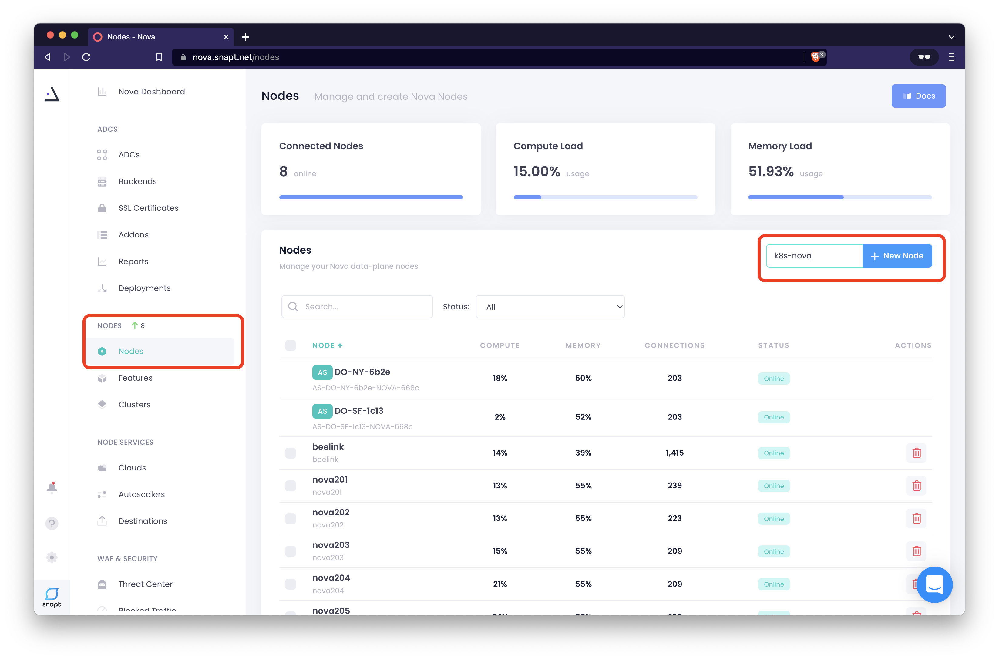
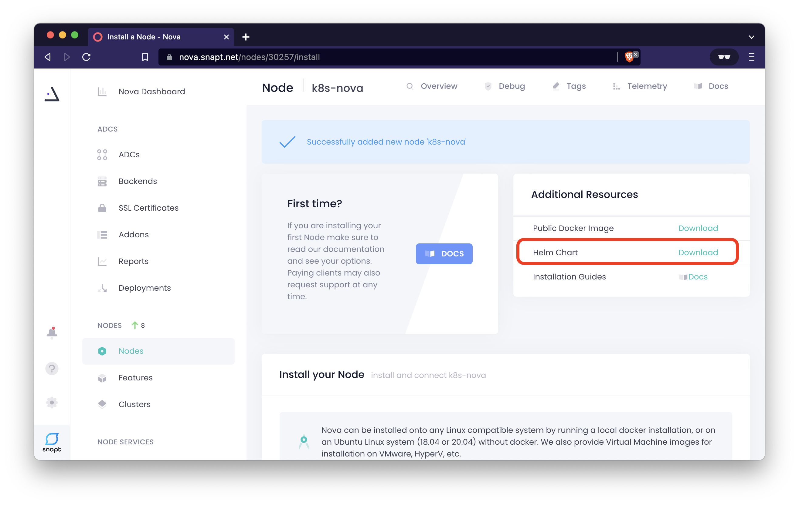
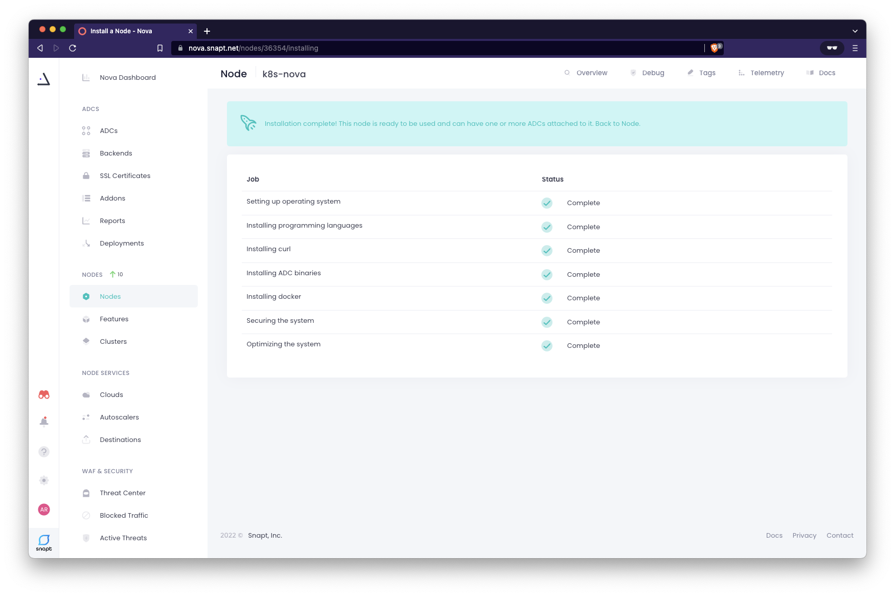
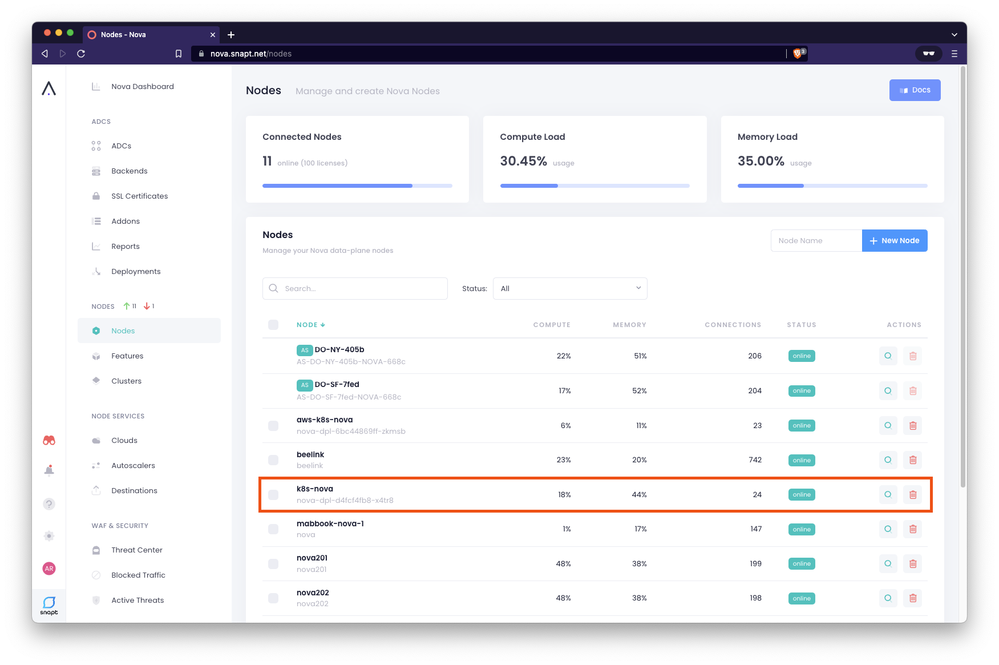
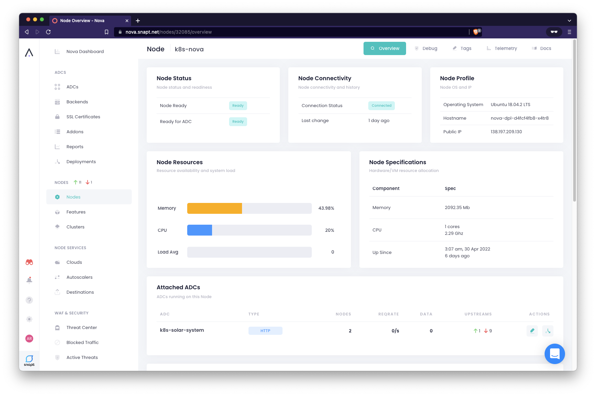

# Deploy Nova for Kubernetes using Helm

## Introduction

Nova for Kubernetes can be easily installed using a [Helm](https://helm.sh/ chart.

Upon install, three Kubernetes components are created. This is the *default* state:

 * A namespace following the following convention: `$release_name-nova-ns`
 * A deployment with a single replica using the `novaadc` client container
 * A `service` with type `LoadBalancer` to route traffic to the nova deployment


### Prerequsites 

Before going any futher, please check you have satisfied the following prerequsites:

 * `Helm` installed on client machine (this is included in development container)
 * You are a registed Nova user with a [Snapt Nova Account](https://www.snapt.net/platforms/nova-adc/register)**
 * You have running a Kubernetes platform supporting the `Service` type [`LoadBalancer`](https://kubernetes.io/docs/concepts/services-networking/service/#loadbalancer)


### Why Nova for Load Balancing in Kubernetes?

NOTE:
[Load Balancing Kubernetes on DigitalOcean](https://www.snapt.net/blog/high-capacity-scalable-kubernetes-k8s-load-balancing-on-digitalocean)

### Why use Helm Charts?
Even for the simplest of deployments (Like our [sample
application](../deploy-sample-application/deploy-sample-application.md)), you
need at least 3 YAML manifests with duplicated and hardcoded values.
[Helm](https://helm.sh/) on the other hand, really simplifying deployment. Helm
is a tool that simplifies the process of creating YAML manifests for Kubernetes
objects. [Helm Charts](https://www.freecodecamp.org/news/what-is-a-helm-chart-tutorial-for-kubernetes-beginners/) are a convenient way to deploy Kubernetes applications. They combine
YAML manifests into single packages, which you can advertise on your clusters
and install with the helm command-line utility that takes care of everything for
you.

### What is service type `LoadBalancer` ?

`LoadBalancer` exposes the `service` externally using a cloud provider's load
balancer. The actual deployment of the load balancer happens asynchronously, and
the `status.loadBalancer` field in the Service indicates whether it has been
provisioned. The required "plumbing" of `NodePort` and `ClusterIP` Services, to
which the external load balancer routes, are automatically created. 

When Nova worker nodes deployed in kubernetes are scaled out, the
`LoadBalancer` will automaticly load balance the cluster of Nova worker
nodes deployed

## Install and Configure Nova for Kubernetes

## Setup a new Nova node on the Nova Controller

1. Log into your [Nova Dashboard](https://nova.snapt.net/)
1. Create a new node: **Nodes > New Node** > [Create new node] e.g. "`k8s-nova`"

  

1. Download helm chart and save the `nova.yml` file into the root directory of your
   project folder - We will need that soon

  

1. Inspect the `nova.yaml` file. You will see the your `node_id` and `node_key` are used
   to identify a Node. This is unique to your Nova account. **Keep these private!**

  ```bash
  bat nova.yaml

   11   │   # The name of the service account to use.
   12   │   # If not set and create is true, a name is generated using the fullname template
   13   │ 
   14   │ node_id: XXxxXXX-XXXX-XXXx-xXXX-XXXXXXXx
   15   │ node_key: N-XXXXXXXXXX-XXXXXXXXXXXXXx...
  ```

### Install Nova for Kubernetes using Helm 

1. Add and update the Snapt helm repo as outlined in the [Nova helm
   installation Instructions](https://nova.snapt.net/docs/1.0/install_helm) 

  ```bash
  $ helm repo add nova-helm https://snapt.github.io/nova-helm

  "nova-helm" has been added to your repositories
  ```
  ```bash
  $ helm repo update

  ...Successfully got an update from the "nova-helm" chart repository
  Update Complete. ⎈Happy Helming!⎈
  ```
1. Now deploy Nova for Kubernetes with our helm values manifest:

  ```bash
  #. Replace <release_name> with your own name, e.g. nova
  # $ helm install <release_name> -f nova.yaml nova-helm/nova
  $ helm install nova -f nova.yml nova-helm/nova

  NAME: nova
  LAST DEPLOYED: Thu May  5 22:37:48 2022
  NAMESPACE: default
  STATUS: deployed
  REVISION: 1
  TEST SUITE: None
  ```

  You may have seen this screen if you had the Node page up in the Nova
  controller during time of `helm install`:

  

1. Inspect the helm deployment. The namespace `nova-ns` is created and is where
   the `nova` is deployed

  ```bash
  $ kubectl get namespaces

  NAME              STATUS   AGE
  default           Active   4d23h
  kube-node-lease   Active   4d23h
  kube-public       Active   4d23h
  kube-system       Active   4d23h
  nova-ns           Active   53s    # <-- There it is!
  solar-system      Active   4d23h
  ```

1. Inspect the `nova-ns` namespace

  ```bash
  $ kubectl get pods,deployments,services -n nova-ns

  NAME                            READY   STATUS    RESTARTS   AGE
  pod/nova-dpl-6bc44869ff-zkmsb   1/1     Running   0          42s

  NAME                       READY   UP-TO-DATE   AVAILABLE   AGE
  deployment.apps/nova-dpl   1/1     1            1           42s

  NAME               TYPE           CLUSTER-IP     EXTERNAL-IP                                                              PORT(S)                                     AGE
  service/nova-svc   LoadBalancer   10.100.73.58   ab966acbf6845494caab3ca1ef0b5210-598635283.us-west-2.elb.amazonaws.com   443:30727/TCP,80:31689/TCP,1080:30011/TCP   42s
  ```
  We can confirm the Nova worker node is deployed successfully inside kubernetes
  because all three are reported:
   * `pod` is `STATUS Running`
   * `deployment` is `READY 1/1` (100% Ready)
   * the service type `LoadBalancer` has an assigned `EXTERNAL-IP` (a very long AWS elb address)

  However, we must also confirm the Nova worker Node is registered and connected
  to the Nova Controller. See next step

1. Find your Nova worker Node under **NODES > Nodes** and view its **Node Status**

  

  

### Troubleshooting Errors

**Errors?** If you have errors with the deployment, see [Troubleshooting Nova Deployment](#troubleshooting)

Congratulations, you have deployed the Nova worker node. Its now ready to
have an ADC policy attached to it and start takeing on workloads. We will to that next.

Go back to [Table of Contents](../../README.md)