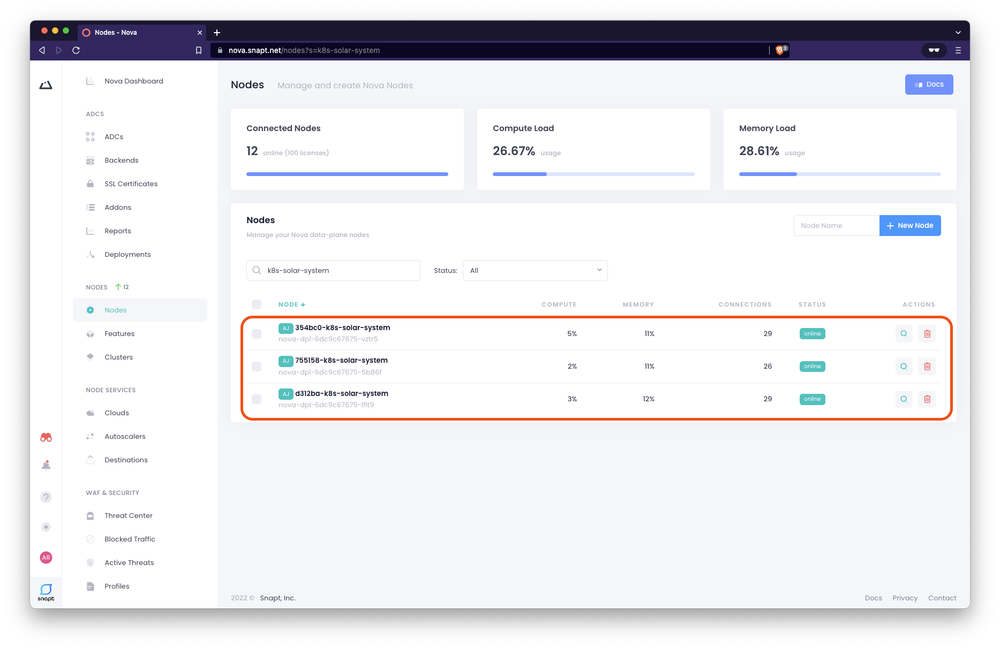

# Scaling Nova Worker Nodes

Nova's Auto Joining capabilities allow us to scale Nova Worker Nodes on-demand,
or set up a replica of many instances for enhanced resiliency and scalability.

Nova's Auto Joining feature allows you to automatically join replicas and scale
your cluster in Kubernetes (or any other container orchestration platform). This
means your containers will sync to an ADC configuration on your Nova Portal,
where they will be ready in seconds. Y You maintain your centralized control and
reporting of them and allow Kubernetes to scale them as required.

## Scaling the Nova deployment

### AdHoc scaling of Nova using kubectl

Adhoc scaling of kuberntes deployments can be achieved using the `kubectl scale`
command. **Note:** This method can be done "on-the-fly" but isn't recorded in
any manifest file for GitOps versioning

1. To scale up the Nova deployment to multiple pods, we can simply use the `kubectl scale`
   command: 

    ```bash
    kubectl scale deployments/nova-dpl --replicas=3 -n nova-ns

    deployment.apps/nova-dpl scaled
    ```

1. Run the `kubectl` get command with `-o wide` flag option to see which Kubernetes
   worker nodes the nova workers (`deployment/nova-dpl`) are deployed on
    
    ```bash
    kubectl get pods,deployments,services -n nova-ns -o wide

    NAME                            READY   STATUS    RESTARTS   AGE   IP              NODE                                          NOMINATED NODE   READINESS GATES
    pod/nova-dpl-6dc9c67675-5b86f   1/1     Running   0          52m   192.168.46.38   ip-192-168-39-46.us-west-2.compute.internal   <none>           <none>
    pod/nova-dpl-6dc9c67675-lflt9   1/1     Running   0          81s   192.168.69.10   ip-192-168-75-90.us-west-2.compute.internal   <none>           <none>
    pod/nova-dpl-6dc9c67675-vztr5   1/1     Running   0          81s   192.168.14.56   ip-192-168-16-86.us-west-2.compute.internal   <none>           <none>

    NAME                       READY   UP-TO-DATE   AVAILABLE   AGE   CONTAINERS   IMAGES                         SELECTOR
    deployment.apps/nova-dpl   3/3     3            3           52m   nova-nvc     novaadc/nova-client-aj:1.0.1   app=nova-nvc,deployment=nova-dpl

    NAME                    TYPE           CLUSTER-IP       EXTERNAL-IP                                                               PORT(S)                      AGE   SELECTOR
    service/nova-svc        LoadBalancer   10.100.8.229     abe758cf80bd44e8e91e0374a1cdb964-55074494.us-west-2.elb.amazonaws.com     443:31431/TCP,80:30428/TCP   52m   app=nova-nvc,deployment=nova-dpl
    ```

    If we executed the last command correctly,  we will have a total of three
    nova workers (`nova-dpl`) deployed, see `pod` in the output above

1. We can confirm addtional Nodes for the AutoJoin cluster have been deployed
   and are registered by Nova. Go to the Nodes list (**Nodes > Nodes**)

    


### Scaling Nova using Helm

We can also scale the Nova deployment by using `helm`.  Helm charts make it easy
to deploy, debug, and update applications in Kubernetes with their separate
values and upgrade lifecycles. This method requires the `replicaCount` to be
defined in helm values manifest so changes can be recorded in version
controller, ideal for GitOps approach to change mangement

1. Make a copy of of the Helm Chart values file, `nova.yml`, where we will make
   our `replicaCount` changes

   ```bash
   cp nova.yml nova-scale.yml
   ```
1. Using a text editor, edit the new file, `nova-scale.yml`, and set the
   `replicaCount` from `1` to `2`. Save changes to the file

    ```yaml
    replicaCount: 2
    ```

1. Now apply the changes using 

    ```bash
    #. Replace <release_name> with your own name, e.g. nova
    # $ helm upgrade <release_name> -f <file_with_changes>.yaml nova-helm/nova
    helm upgrade nova -f nova-scale.yml nova-helm/nova

    Release "nova" has been upgraded. Happy Helming!
    NAME: nova
    LAST DEPLOYED: Tue May 10 19:40:57 2022
    NAMESPACE: default
    STATUS: deployed
    REVISION: 2
    TEST SUITE: None
    ```

    We can see an upgrade was successfully made and the `REVISION` version is
    incremented (`2` in the example output above)

Awesome. We know how to deploy Nova a clusters of multiple instances and scale
nova workers on-the-fly

---

Go back to [Table of Contents](../../README.md)