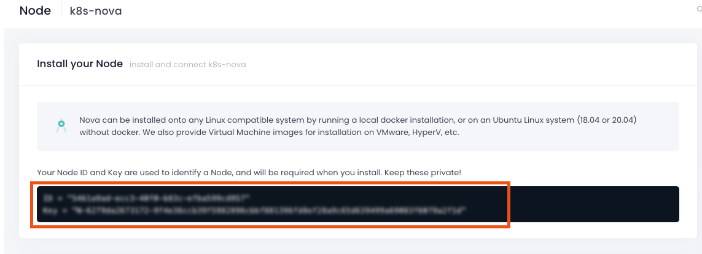

# Test access to our applications

We can run some quick tests from a pod *inside* the kubernetes cluster and from a
external client over the internet

## Test connectivity to our application from *inside* the kubernetes cluster

From our network utility container, *inside* the kubernetes cluster


1.  Make a internal request using `curl` to the `sun-svc` service:
    
    ```bash
    kubectl exec -i -t network-tools -- curl  _http._tcp.sun-svc.solar-system.svc.cluster.local:8080
    ```

1. Make a internal request using `curl` to the `moon-svc` service:
  
    ```bash
    kubectl exec -i -t network-tools -- curl  _http._tcp.moon-svc.solar-system.svc.cluster.local:8080
    ```

1. Make a internal request using `curl` to the nova worker node (pod) directly using the `clusterIP`:

  ```bash
  # using the default / path
  kubectl exec -i -t network-tools -- curl 10.100.138.162 -I
  HTTP/1.1 200 OK
  Date: Fri, 06 May 2022 16:45:50 GMT
  Content-Type: text/plain
  Content-Length: 210
  Expires: Fri, 06 May 2022 16:45:49 GMT
  Cache-Control: no-cache
  Server: NOVA    # <---This confirms we have been proxied by the Nova ADC worker node
  Set-Cookie: NOVAID-3da547439a9e6285686202e9c8f610b1=dba2f13a1909f004; path=/; HttpOnly
  ```

1. Make a series of internal requests using `curl` to the nova worker node (pod)
   directly using the `clusterIP`, via Nova, we will be equally load balanced in
   a round robin manner:

  ```bash
  kubectl exec -i -t network-tools -- /bin/bash -c "for i in {1..10}; do curl -s http://10.100.138.162 | grep 'Server address'; done"
  # You can see we have been load balanced in "Round Robin":
  Server address: 192.168.26.52:8080
  Server address: 192.168.70.95:8080
  Server address: 192.168.26.52:8080
  Server address: 192.168.70.95:8080
  Server address: 192.168.26.52:8080
  Server address: 192.168.70.95:8080
  Server address: 192.168.26.52:8080
  Server address: 192.168.70.95:8080
  Server address: 192.168.26.52:8080
  Server address: 192.168.70.95:8080
  ```

## Test access to our application from *outside* the kubernetes cluster

From our a external client machine, *outside* the kubernetes cluster





1. Find the the external DNS name or Public IP address associated to the
   `loadBalancer` for the Nova (`nova-srv`) service.

  ```bash
  # Get External loadBalancer address
  NOVA_LB=$(kubectl get services/nova-svc -n nova-ns -o jsonpath='{.status.loadBalancer.ingress[*].hostname}') 
  # Optional: Get the IPv4 Address
  # NOVA_LB=$(dig +short $COFFEE_LB A |  awk 'NR==1')
  ```

1. Now run a `curl` command to test access from *outside* the kubernetes
   cluster, in a terminal or web browser on you your client machine 

  ```bash
  # Using curl 
  curl http://$NOVA_LB

  # Using a web browser - get the DNS or IP address and enter into your web browser
  echo $NOVA_LB

  ad95405e2bbfc4e97af5866540135fe2-1347037189.us-west-2.elb.amazonaws.com
  ```