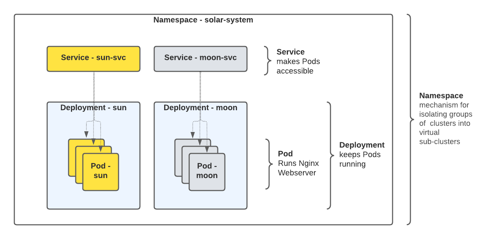

# Deploy our Sample Applications

## Introduction

We will deploy our sample applications using [Kubernetes manifest files](https://docs.microsoft.com/en-us/azure/aks/concepts-clusters-workloads#deployments-and-yaml-manifests)
provided.   In this example, a manifest specifies
all of the objects required to run both sun and moon apps. It defines the desired state of the cluster, such as which container images to use,
replica count, resource limits, and so on.

We have a preconfigured manifests for the following setup:

* Two
  [deployments](https://docs.microsoft.com/en-us/azure/aks/concepts-clusters-workloads#deployments-and-yaml-manifests):
  One for the **sun** application and the other for a **moon** application; both
  are simple web servers presenting a web page. 

- Two
  [Kubernetes](https://docs.microsoft.com/en-us/azure/aks/concepts-network#services)
  [Services](https://docs.microsoft.com/en-us/azure/aks/concepts-network#services):
  one for each application. the **moon-srv** and **sun-srv** `Service` provides
  the network connectivity to the pods in our **sun** and **moon** deployments
  and keeps track of Pod Endpoints (IP address and ports) we can connect to. We
  will experient with a "normal" and
  "[headless](https://kubernetes.io/docs/concepts/services-networking/service/#headless-services)"
  versions of these services for[ DNS discovery of services and
  pods](https://kubernetes.io/docs/concepts/services-networking/dns-pod-service/#a-aaaa-records).



## Deploy the application 

1. Review the  `deployments/simple-app` folder
   
    ```bash
    tree deployments/simple-app 
    
    deployments/simple-app
    ├── namespace.yaml            # Create the 'solar-system' namespace
    ├── simple-app-headless.yaml  # "headless" service option (i.e. clusterIP: None)
    |                             # for our moon and sun apps, 'moon-svc' and 'sun-svc'
    ├── simple-app-service.yaml   # (normal) service for our moon and sun apps, 'moon-svc' and 'sun-svc'
    └── simple-app.yaml           # Our sample apps:'moon' and 'sun' deployments
    
    0 directories, 4 files

    ```
   
1. Create the **solar-system**
   [namespace](https://kubernetes.io/docs/concepts/overview/working-with-objects/namespaces/).
   This is our "virtual cluster" where we deploy our sun and moon application.
   Run the   [`kubectl
   apply`](https://kubernetes.io/docs/reference/generated/kubectl/kubectl-commands#apply)
   against the `namespace.yaml`  manifest file and run [`kubectl
   get`](https://kubernetes.io/docs/reference/generated/kubectl/kubectl-commands#get)
   to view the  resources

    ```bash
    # Create namespace
    kubectl create -f deployments/simple-app/namespace.yaml 

    namespace/solar-system created
    ```

    ```bash
    # Check that its exists in our cluster
    kubectl get namespaces

    NAME              STATUS   AGE
    default           Active   7m47s
    kube-node-lease   Active   7m49s
    kube-public       Active   7m49s
    kube-system       Active   7m49s
    solar-system      Active   2s    #<-- There it is!
    ```

1. Now that our **solar-system** namespace exists, we can run the [`kubectl
   apply`](https://kubernetes.io/docs/reference/generated/kubectl/kubectl-commands#apply)again,
   this time to deploy the **sun** and **moon** `deployments` and`services` on
   to our cluster.  Create **sun** and **moon** Deployments

    ```bash
    kubectl apply -f deployments/simple-app/simple-app.yaml

    deployment.apps/sun created
    deployment.apps/moon created
    ```

1. Create **sun** and **moon**  Services. (these are "normal services" with `ClusterIP`)

    ```bash
    kubectl apply -f deployments/simple-app/simple-app-service.yaml

    service/sun-svc created
    service/moon-svc created
    ```


1. We can run [`kubectl
   get`](https://kubernetes.io/docs/reference/generated/kubectl/kubectl-commands#get)
   again to view the resources we have deployed in the **solar-system**
   namespace

    ```bash
    kubectl get pods,deployments,services -n solar-system

    NAME                        READY   STATUS    RESTARTS   AGE
    pod/moon-6cf747975f-thcp8   1/1     Running   0          3m3s
    pod/sun-569fc796b7-7p969    1/1     Running   0          2m56s

    NAME                   READY   UP-TO-DATE   AVAILABLE   AGE
    deployment.apps/moon   1/1     1            1           4m37s
    deployment.apps/sun    1/1     1            1           4m37s

    NAME               TYPE        CLUSTER-IP       EXTERNAL-IP   PORT(S)   AGE
    service/moon-svc   ClusterIP   10.100.195.82    <none>        80/TCP    4m13s
    service/sun-svc    ClusterIP   10.100.130.214   <none>        80/TCP    4m14s
    ```

  `READY` and `AVAILABLE`  `1/1` and `STATUS Running` reassure us that 	everything is working OK! 

## Scaling the deployment

1. To scale out the sun and moon deployments to multiple pods, we can edit the
   manifest `yaml` file and reapply the config, or simply with a `kubectl scale` command: 

    ```bash
    kubectl scale deployments/moon --replicas=3 -n solar-system
    kubectl scale deployments/sun --replicas=4 -n solar-system

    deployment.apps/moon scaled
    deployment.apps/sun scaled
    ```

1. Run the `kubectl` get command with `-o wide` flag option to see which Kubernetes
   worker nodes the sun and moon pods were deployed on

    If we executed the last command correctly,  we will have deployed four sun pods and three moon pods

    ```bash
    kubectl get pods,deployments,services -n solar-system -o wide

    NAME                        READY   STATUS    RESTARTS   AGE     IP               NODE                                           NOMINATED NODE   READINESS GATES
    pod/moon-6cf747975f-9st5t   1/1     Running   0          11s     192.168.26.52    ip-192-168-30-155.us-west-2.compute.internal   <none>           <none>
    pod/moon-6cf747975f-jmpnv   1/1     Running   0          11s     192.168.59.249   ip-192-168-48-238.us-west-2.compute.internal   <none>           <none>
    pod/moon-6cf747975f-thcp8   1/1     Running   0          3m32s   192.168.70.95    ip-192-168-74-60.us-west-2.compute.internal    <none>           <none>
    pod/sun-569fc796b7-7p969    1/1     Running   0          3m25s   192.168.72.194   ip-192-168-74-60.us-west-2.compute.internal    <none>           <none>
    pod/sun-569fc796b7-fphd8    1/1     Running   0          10s     192.168.19.250   ip-192-168-30-155.us-west-2.compute.internal   <none>           <none>
    pod/sun-569fc796b7-h754f    1/1     Running   0          10s     192.168.30.16    ip-192-168-30-155.us-west-2.compute.internal   <none>           <none>
    pod/sun-569fc796b7-hcrvt    1/1     Running   0          10s     192.168.32.100   ip-192-168-48-238.us-west-2.compute.internal   <none>           <none>

    NAME                   READY   UP-TO-DATE   AVAILABLE   AGE    CONTAINERS   IMAGES                                   SELECTOR
    deployment.apps/moon   3/3     3            3           5m6s   moon         armsultan/test-page:plain-text-nonroot   app=moon
    deployment.apps/sun    4/4     4            4           5m6s   sun          armsultan/test-page:plain-text-nonroot   app=sun

    NAME               TYPE        CLUSTER-IP       EXTERNAL-IP   PORT(S)   AGE     SELECTOR
    service/moon-svc   ClusterIP   10.100.195.82    <none>        80/TCP    4m43s   app=moon
    service/sun-svc    ClusterIP   10.100.130.214   <none>        80/TCP    4m44s   app=sun
    ```

Congratulations, you have deployed the sample application but we still cannot
access our applications from outside the kubernetes cluster yet. We will figure
that out next.

---

Go back to [Table of Contents](../../README.md)