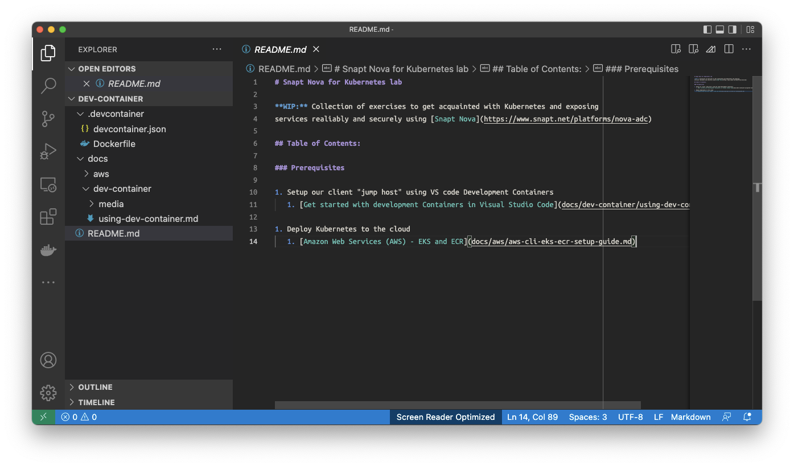
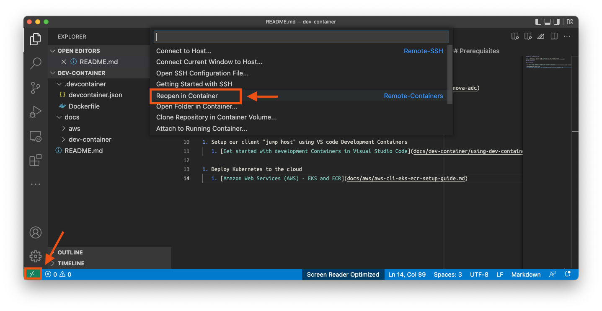
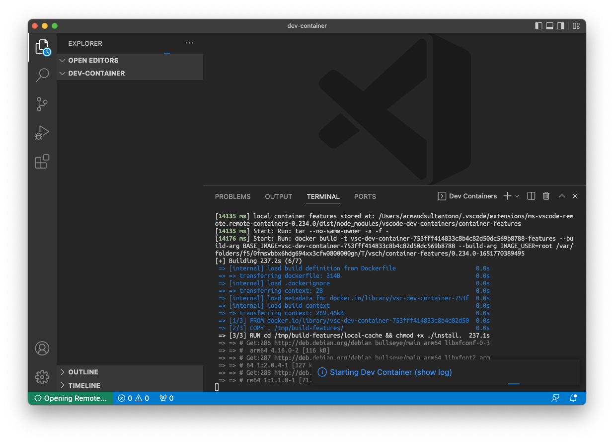
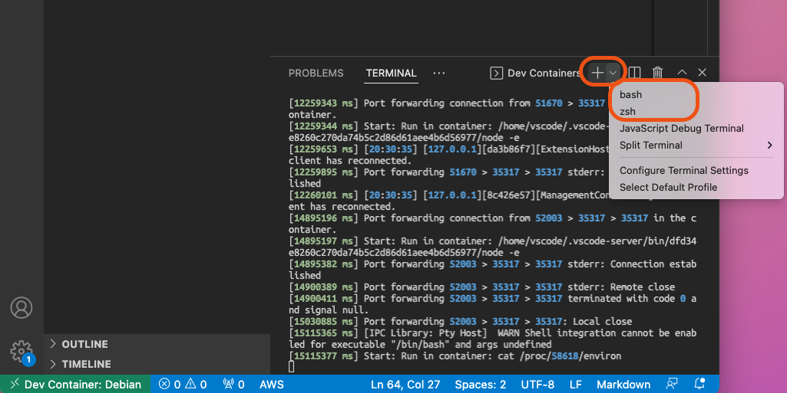

# Lab Setup - using development Containers in Visual Studio Code

We recommend using our development Container in Visual Studio Code for this lab
exercise for convenience which will include all the tools required to follow the
lab. Continue on with this lab setup guide to install the prerequsites tools on
your client machine

If you are wish to follow this lab without the development Container, you will
need to make sure you have entire set of prerequsite tools installed on your
client machine. [See the Prerequisites
guide](../sans-dev-container/lab-setup-sans-dev-container.md)

## Get started with development Containers in Visual Studio Code

"[Visual Studio Code, Remote
Development](https://code.visualstudio.com/docs/remote/remote-overview)" allows
us to use a container as a full-featured development environment, or our "jump
host", with all essential tools such as `kubectl`, `helm`, and
the public cloud CLI tools to provision and manage our Kubernetes clusters and
application deployments.

## Prerequisites

We will be using a local container deployment for our development environement.
See [Developing inside a
Container](https://code.visualstudio.com/docs/remote/containers) for complete
details of this setup, the prerequsite system requirements and installation
instructions.

In summary, you need:

 * [Visual Studio Code](https://code.visualstudio.com/)
 * [Docker](https://docs.docker.com/get-docker/) is needed to create and manage
   your containers.
 * [Remote - Containers extension](https://code.visualstudio.com/docs/remote/containers-tutorial) for VS code


## Setup

Provided you have the Prerequisites installed and the his project file on the
same machine, you can now follow the steps below to start the development
container in VS Code

1. Enter this project folder root. There should be a `.devcontainer` folder
   here, and inside here a `devcontainer.json` file, with this your dev container is
   functional

  

1. Connect to and start our development container. Run the **Remote-Containers:
   Reopen in Container command**. If you run the container for the first time,
   the container needs to be built first. This may take some time.

  

  Please be patient when opening the container for the first time. The container
  must be built for the first time and will take a few minutes.

  

1. Once the container is ready, a terminal session in the container is
   available. If this does not show up immediately, you can start a new `bash`
   or `zsh` terminal session at any time via the **+** (plus) icon drop down
   menu in the bottom pane

  

## Troubleshooting

If you need to force a rebuild of the dev container, run the following commands

```bash
# in host terminal
cd .devcontainer
docker build --no-cache .          # build the image without using the local cached layers
docker build --no-cache --pull .   # also pull new base image (FROM)
# after build the image, reopen remote container in the vscode
```

We are now ready to run the lab! - Go back to [Table of Contents](../../README.md)